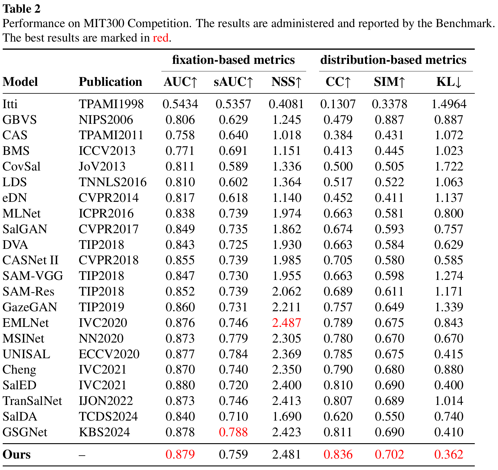

# BioSalNet: Biologically Inspired Saliency Prediction

[](https://opensource.org/licenses/MIT)

This repository contains the official **implementation code and resources** for the paper **"BioSalNet: Biologically Inspired Saliency Prediction"** (currently under review).

> **Note on Code Availability**: To facilitate research reproducibility and peer review, we are providing the complete implementation of BioSalNet, including the full model architecture, training framework, data loaders, and evaluation metrics. The code is now fully open-source and available for academic use.

## 📖 Overview

This project implements a novel deep learning model for visual saliency prediction, inspired by biological vision mechanisms. Saliency prediction aims to identify the most visually conspicuous regions in an image, mimicking human gaze behavior.

## 🚀 Features

*   **Complete Training & Evaluation Pipeline**:Full code for training and testing saliency prediction models, including the complete model architecture.
*   **Multi-Dataset Support**: Data loaders and pre-processing scripts for popular saliency benchmarks (e.g., SALICON, MIT1003, CAT2000).
*   **Comprehensive Evaluation Metrics**: Implementation of standard saliency metrics ( NSS, CC, SIM, KL-Divergence, etc.).
*   **Modular Design**: Easy-to-extend code structure for integrating new models and datasets.


## ⚙️ Installation

### Our Experiment Environment
**Note:** Other environments may also work, but the following is the exact setup we used for all experiments, which guarantees reproducibility.

```bash
# Core Deep Learning Framework
torch==2.1.1+cu118
torchvision==0.16.1+cu118
transformers==4.35.2
timm==1.0.19
mmcv==1.3.8
mmsegmentation==0.14.1
opencv-python==4.8.1.78
numpy==1.26.4
matplotlib==3.8.2
scikit-image==0.25.2
scipy==1.11.4
pandas==2.1.3
Pillow==10.1.0
```
## 📥 Data Acquisition

### SALICON Dataset
The **SALICON** dataset is available through the official SALICON website. Due to the dynamic nature of online resources, we recommend searching for the most current access point using the dataset's official title: **"SALICON: Saliency in Context"**.

- **Official Reference**: Look for the SALICON dataset on academic data portals or the publisher's website associated with the original paper.
- **Content**: This dataset provides the `images/` (stimuli) and `maps/` (saliency maps) directories for your saliency prediction task.

### Depth Maps
The depth maps used in our work are not part of the original SALICON dataset. They were generated using pre-trained monocular depth estimation models.

- **Recommended Tool**: A modern and effective choice is the **Depth Anything2** model, which provides a robust and unified solution for monocular depth estimation.
    - **Source Code & Model**: You can find the official implementation and pre-trained models on its [GitHub repository](https://github.com/DepthAnything/Depth-Anything-V2).
    - **Usage**: You can process the SALICON images through this model to generate the corresponding depth maps for the `depth/` directory.


## 🛠️ Configuration

The training script `train_BioSalNet.py` accepts several important command-line arguments for configuration:
### SALICON Dataset Structure
```bash
salicon/
├── images/
│   ├── train/          # Training images
│   └── val/            # Validation images
├── depth/
│   ├── train/          # Depth maps for training images
│   └── val/            # Depth maps for validation images
└── maps/
    ├── train/          # Saliency maps for training images
    └── val/            # Saliency maps for validation images
```

### Dataset Paths
- `--salicon-root`: Root directory of SALICON dataset
- `--train-csv`: Path to CSV file listing training samples (default: `dataset/salicon_train.csv`)
- `--val-csv`: Path to CSV file listing validation samples (default: `dataset/salicon_val.csv`)

### Output & Logging
- `--log-dir`: Directory to save model checkpoints and training logs (default: `outputs/checkpoints`)

### Usage Example

```bash
python train_BioSalNet.py \
    --salicon-root /path/to/your/salicon/dataset \
    --train-csv path/to/train.csv \
    --val-csv path/to/val.csv \
    --log-dir outputs/my_experiment
```

We provide an easy-to-use interface `interface_BioSalNet.py` for running predictions with our pre-trained model.
### Arguments
- `--images`: Path to directory containing input images (default: samples/images)
- `--depth`: Path to directory containing depth maps (default: samples/depth)
- `--outpath`: Path to directory where predictions will be saved (default: outputs/predictions)
-  `--weights`:Path to pre-trained model weights file (default: None - will use built-in weights if available)

### Usage Example

```bash
python interface_BioSalNet.py \
    --images samples/test_images \
    --depth samples/test_depth \
    --outpath outputs/my_predictions \
    --weights downloads/biosalnet_weights.pth
```

## 📊 Results and Pre-trained Models

### Model Weights
We provide pre-trained model weights for researchers to reproduce our results:

- **BioSalNet Pre-trained Weights**: [Download Link](https://drive.google.com/file/d/1IPQbtiPwQUwZmONw1AXY8EX0GOWkdlrQ/view?usp=drive_link)
  - Trained on SALICON training set
  - Compatible with the code in this repository
 
### Quantitative Results
We provide detailed performance curves for our model on major benchmarks:

<p align="center">
  
    
  
</p>

### Qualitative Comparisons
Visual comparison of our model's predictions against ground truth and other methods:

<p align="center">
  
</p>

### Prediction Visualizations
To help visualize the performance of our model, we provide prediction examples on both datasets:

- **SALICON Predictions**: [View Examples](https://drive.google.com/file/d/1nFw1X7ANIi4dXNnNPmtlo9v7IJZv4mPS/view)
- **MIT300 Predictions**: [View Examples](https://drive.google.com/file/d/1Ih0ImW5ZAK94geiUYVcwXdBjqe2pKjSa/view?usp=drive_link)

These visualizations include input images, ground truth saliency maps, and our model's predictions.

## 🤝 Acknowledgements

We thank the contributors of the following libraries and datasets that made this work possible:

- [SALICON](https://salicon.net/challenge-2017/)
- [MIT300 & MIT1003](https://saliency.tuebingen.ai/)
- [CAT2000](https://people.csail.mit.edu/tjudd/WherePeopleLook/index.html)
- [TORONTO](http://www-sop.inria.fr/members/Neil.Bruce/)
- [Depth Anything V2](https://github.com/DepthAnything/Depth-Anything-V2) for depth estimation
